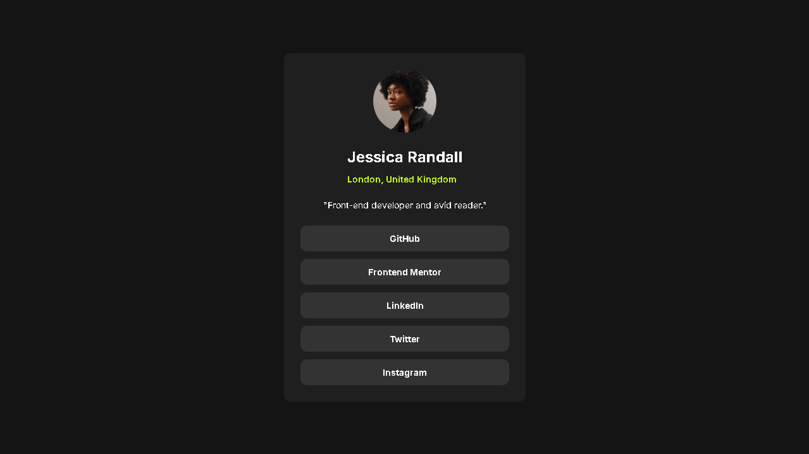

# Frontend Mentor - Social links profile solution

This is a solution to the [Social links profile challenge on Frontend Mentor](https://www.frontendmentor.io/challenges/social-links-profile-UG32l9m6dQ). Frontend Mentor challenges help you improve your coding skills by building realistic projects. 

## Table of contents

- [Overview](#overview)
  - [The challenge](#the-challenge)
  - [Screenshot](#screenshot)
  - [Links](#links)
- [My process](#my-process)
  - [Built with](#built-with)
- [Highlights](#highlights)

## Overview

### The challenge

Users should be able to:

- See hover and focus states for all interactive elements on the page

### Screenshot

### Links

- Solution URL: [Add solution URL here](https://your-solution-url.com)
- Live Site URL: [Add live site URL here](https://your-live-site-url.com)

## My process

### Built with

- Semantic HTML5 markup
- CSS custom properties
- Flexbox
- Mobile-first workflow

## Highlights

The most important part of my process in this project was focusing on a clean and structured HTML with semantic elements, which made the layout easier to understand and style. I paid special attention to class naming using the BEM convention to keep the CSS organized and scalable. I also implemented clear hover and :focus-visible states to support both mouse and keyboard navigation, improving accessibility and user experience. Using CSS variables for colors and typography helped maintain consistency across the component while keeping the code easy to maintain.